# Gladia MCP



<p align="center">
  <a href="https://www.npmjs.com/package/@gladiaio/mcp"></a>
  <a href="LICENSE"></a>
  <a href="https://nodejs.org"></a>
</p>

**Speech-to-text for AI assistants.** [`@gladiaio/mcp`](https://www.npmjs.com/package/@gladiaio/mcp) is an open-source [Model Context Protocol](https://modelcontextprotocol.io) server that connects hosts like Cursor, Claude, and Codex to your [Gladia](https://www.gladia.io) account.

Create pre-recorded transcription jobs and manage both pre-recorded and live jobs — with speaker diarization, translation, subtitles, summaries, sentiment analysis, named-entity recognition, PII redaction, and custom vocabulary. Live tools are metadata-only (get / list / delete); this server does not start or stream live audio.

> Creating a transcription is billable to the account behind your `GLADIA_API_KEY`. The server returns a job ID immediately; Gladia finishes the work asynchronously.

<p align="center">
  <strong>Start here:</strong> <a href="#install">Install</a> · <a href="#quick-start">Quick start</a> · <a href="#try-it">Try it</a> · <a href="#features">Features</a> · <a href="#mcp-interface">MCP interface</a> · <a href="#docs--links">Docs &amp; links</a>
</p>

## Install

You need:

- [Node.js](https://nodejs.org) **22.18+** (22 and 24 are tested)
- A Gladia API key from [app.gladia.io](https://app.gladia.io)
- An MCP-compatible host (Cursor, Claude Desktop, Claude Code, Codex, …)

The published package is [`@gladiaio/mcp`](https://www.npmjs.com/package/@gladiaio/mcp). Hosts typically launch it with `npx` — no global install required.

## Quick start

### Cursor

Add this to `.cursor/mcp.json` (project) or your Cursor MCP settings:

```json
{
  "mcpServers": {
    "gladia": {
      "command": "npx",
      "args": ["-y", "@gladiaio/mcp"],
      "env": {
        "GLADIA_API_KEY": "your-api-key"
      }
    }
  }
}
```

### Claude Code

```sh
claude mcp add gladia --env GLADIA_API_KEY=your-api-key -- npx -y @gladiaio/mcp
```

### Claude Desktop

Use the same JSON shape as Cursor in Claude Desktop’s MCP config, then restart the app.

### Codex

```sh
codex mcp add gladia --env GLADIA_API_KEY=your-api-key -- npx -y @gladiaio/mcp
```

This configures the server for the Codex CLI, IDE extension, and ChatGPT desktop app (they share MCP config).

Restart your host after changing config. **Never** commit your API key or pass it as a tool argument.

## Try it

Once connected, ask your assistant something like:

> Transcribe [https://example.com/interview.mp3](https://example.com/interview.mp3) with speaker diarization and a bullet-point summary.

Typical pre-recorded flow:

1. `transcribe_pre_recorded` creates a job and returns its ID right away.
2. `get_pre_recorded_transcription` polls until status is `done` or `error`.
3. The completed response includes the transcript and any requested add-ons.
4. `list_pre_recorded_transcriptions` browses jobs (filters + pagination).
5. `delete_pre_recorded_transcription` permanently removes a remote job when you are done.

For live sessions started outside MCP (SDK, [CLI](https://github.com/gladiaio/gladia-cli), or another app), use `get_live_transcription`, `list_live_transcriptions`, and `delete_live_transcription`. Pre-recorded and live IDs are separate namespaces — always use the matching tool family.

Built-in prompts:

- “Use `transcribe_with_diarization` for this recording.”
- “Use `transcribe_and_translate` to translate this recording into French.”
- “Use `explain_transcription_result` for job `<job-id>`.”

## Features

| Capability                   | Support         |
| ---------------------------- | --------------- |
| Pre-recorded transcription   | Yes             |
| Live get / list / delete     | Yes             |
| Live create / streaming      | No              |
| Language hints and switching | Yes             |
| Speaker diarization          | Yes             |
| Translation                  | Yes             |
| SRT and VTT subtitles        | Yes             |
| Summarization                | Yes             |
| Sentiment analysis           | Yes             |
| Named-entity recognition     | Yes             |
| PII redaction                | Yes             |
| Custom vocabulary            | Yes             |
| Trusted local-file uploads   | Desktop default |

Options for `transcribe_pre_recorded` use the same nested field names as Gladia’s [pre-recorded API](https://docs.gladia.io/chapters/pre-recorded-stt/quickstart). Example:

```json
{
  "audio_url": "https://example.com/interview.mp3",
  "language_config": {
    "languages": ["en"]
  },
  "diarization": true,
  "translation": true,
  "translation_config": {
    "target_languages": ["fr"]
  },
  "summarization": true,
  "summarization_config": {
    "type": "bullet_points"
  }
}
```

The MCP process does not download remote media. Public HTTPS URLs are passed to Gladia through the official [`@gladiaio/sdk`](https://www.npmjs.com/package/@gladiaio/sdk).

## Local files

`upload_audio` can read files from disk, but only inside trusted roots. When `GLADIA_LOCAL_FILE_ROOTS` is unset, that root is your Desktop. Paths (absolute or relative) must resolve inside that directory — or inside roots you configure. Paths outside are rejected.

```sh
GLADIA_LOCAL_FILE_ROOTS=/absolute/path/to/audio npx -y @gladiaio/mcp
```

Separate multiple roots with `:` on macOS/Linux or `;` on Windows. Set `GLADIA_LOCAL_FILE_ROOTS` to an empty value to disable local uploads.

After a successful upload, pass the returned `audio_url` to `transcribe_pre_recorded`.

Safety checks: symlink resolution before root checks, regular files only, max **1,000,000,000** bytes. Only point roots at directories you trust the host to upload.

## MCP interface

### Tools

| Tool                                | What it does                                                       |
| ----------------------------------- | ------------------------------------------------------------------ |
| `delete_live_transcription`         | Permanently deletes an existing live session and its data.         |
| `delete_pre_recorded_transcription` | Permanently deletes a pre-recorded job and its data.               |
| `get_live_transcription`            | Gets an existing live session’s status and available result.       |
| `get_pre_recorded_transcription`    | Gets a pre-recorded job’s current status and available result.     |
| `list_live_transcriptions`          | Lists existing live sessions with optional filters and pagination. |
| `list_pre_recorded_transcriptions`  | Lists pre-recorded jobs with optional filters and pagination.      |
| `transcribe_pre_recorded`           | Starts an asynchronous, billable pre-recorded job.                 |
| `upload_audio`                      | Uploads a file from an allowed root (Desktop by default).          |

> **Breaking rename:** `get_transcription`, `list_transcriptions`, and `delete_transcription` are now `get_pre_recorded_transcription`, `list_pre_recorded_transcriptions`, and `delete_pre_recorded_transcription`.

### Resources

- `gladia://pre-recorded/{id}` — status and result for a pre-recorded job
- `gladia://live/{id}` — status and result for an existing live session
- `gladia://docs/feature-matrix` — supported and deferred capabilities
- `gladia://docs/pre-recorded-limits` — concurrency, duration/size/channels, formats
- `gladia://docs/sdk-policy` — SDK, billing, and local-file safety policy

### Prompts

- `explain_transcription_result`
- `transcribe_and_translate`
- `transcribe_with_diarization`

All tools publish input/output schemas, structured results, and a JSON text fallback for hosts that do not consume structured content.

## Configuration

| Variable                  | Required | Purpose                                                                                        |
| ------------------------- | -------- | ---------------------------------------------------------------------------------------------- |
| `GLADIA_API_KEY`          | Yes      | Authenticates your Gladia account.                                                             |
| `GLADIA_API_URL`          | No       | Overrides the SDK API URL for a trusted proxy or test server.                                  |
| `GLADIA_LOCAL_FILE_ROOTS` | No       | Trusted directories for local uploads. Defaults to Desktop when unset; empty disables uploads. |

Stdio transport only; one Gladia account per process. Diagnostics go to **stderr** so stdout stays the MCP channel. User-visible errors are sanitized (no credentials, headers, or transcript payloads in messages).

## Current scope

This release is intentionally small and stateless: pre-recorded create/get/list/delete and live get/list/delete via the official SDK. It does **not** support live session create/streaming, callbacks, audio-to-LLM, custom spelling, or a hosted HTTP/OAuth transport.

## Development

```sh
git clone https://github.com/gladiaio/mcp.git
cd mcp
npm ci
npm test
```

Use Node 22 or 24. Before opening a PR, run:

```sh
npm run check
```

That covers formatting, lint, TypeScript, coverage (≥90%), build, a real stdio handshake, and package checks. Prefer test-first changes with injected `PreRecordedClient` / `LiveClient` mocks — not real credentials or mocked network calls.

### Optional integration test

Creates a **billable** job and deletes it in `finally`. Not part of PR CI:

```sh
GLADIA_API_KEY=your-api-key \
GLADIA_TEST_AUDIO_URL=https://example.com/audio.mp3 \
npm run test:integration
```

Inspect a local build with the [MCP Inspector](https://modelcontextprotocol.io/docs/tools/inspector):

```sh
npm run build
GLADIA_API_KEY=your-api-key npx @modelcontextprotocol/inspector node dist/index.js
```

### Releasing to npm

Maintainer-only via GitHub Actions **Publish**:

1. Ensure `NPM_TOKEN` can publish `@gladiaio/mcp`.
2. Run **Publish** with a SemVer (e.g. `0.1.1` or `v0.1.1`).
3. Review and merge the automated `release/vX.Y.Z` PR.
4. That merge automatically creates tag `vX.Y.Z` and runs `npm publish --access public --provenance`.

Do not publish from a laptop.

## Docs & links

| Resource                  | Link                                                                                                               |
| ------------------------- | ------------------------------------------------------------------------------------------------------------------ |
| Gladia product            | [gladia.io](https://www.gladia.io)                                                                                 |
| API documentation         | [docs.gladia.io](https://docs.gladia.io)                                                                           |
| Pre-recorded quickstart   | [docs.gladia.io/chapters/pre-recorded-stt/quickstart](https://docs.gladia.io/chapters/pre-recorded-stt/quickstart) |
| Get an API key            | [app.gladia.io](https://app.gladia.io)                                                                             |
| npm package               | [@gladiaio/mcp](https://www.npmjs.com/package/@gladiaio/mcp)                                                       |
| JavaScript SDK            | [@gladiaio/sdk](https://www.npmjs.com/package/@gladiaio/sdk)                                                       |
| Terminal CLI              | [gladiaio/gladia-cli](https://github.com/gladiaio/gladia-cli)                                                      |
| Model Context Protocol    | [modelcontextprotocol.io](https://modelcontextprotocol.io)                                                         |
| Issues & feature requests | [github.com/gladiaio/mcp/issues](https://github.com/gladiaio/mcp/issues)                                           |

## License

[MIT](LICENSE) © [Gladia](https://www.gladia.io)
